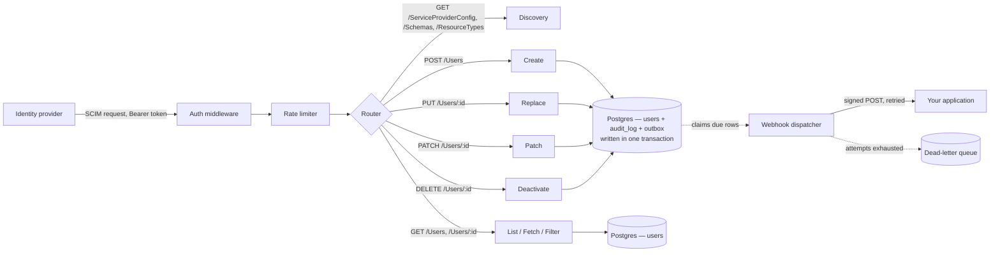

<div align="center">

# 🛡️ SCIMage

### A SCIM 2.0 provisioning server, built from the other side of the wire


</div>

SCIMage is a focused SCIM 2.0 server written in Go. It implements the core `/Users` resource from [RFC 7644](https://datatracker.ietf.org/doc/html/rfc7644), backed by real Postgres, with security practices that are load-bearing and covered by tests.

## 💡 Why I built this

I spent two years building JML (joiner mover leaver) automation on the identity provider side, configuring Okta Workflows to push user provisioning into 60+ SaaS applications. That gave me a solid understanding of the SCIM spec from the client's point of view.

This project is the other half: the server that receives those SCIM calls and applies them, which is the side most SaaS products build and maintain themselves. It demonstrates both ends of the handshake.

## ⚙️ What it does

SCIMage is the *service provider* side of SCIM — the endpoint an identity provider provisions into.

| Method | Endpoint      | Behaviour                                                                       |
|--------|---------------|---------------------------------------------------------------------------------|
| POST   | `/Users`      | Creates a user. `201` with a `Location` header, `409` on a duplicate `userName` |
| GET    | `/Users/{id}` | Fetches one user                                                                |
| GET    | `/Users`      | Lists users, paginated with `startIndex` and `count`                            |
| PUT    | `/Users/{id}` | Replaces a user's attributes                                                    |
| PATCH  | `/Users/{id}` | Applies operations to a user — how identity providers deprovision               |
| DELETE | `/Users/{id}` | Deactivates a user, preserving the row and its history                          |

The discovery endpoints `/ServiceProviderConfig`, `/ResourceTypes` and `/Schemas` declare exactly the attributes this server stores. A client reads them before provisioning.

`GET /Users` supports `filter=userName eq "…"` and `filter=externalId eq "…"`, the lookups a provider uses to decide whether a user already exists. Other expressions answer `400` with `scimType: invalidFilter`, telling the client plainly where the supported set ends.

Responses use `application/scim+json`, and errors use the SCIM Error schema with the appropriate `scimType`.

`userName` uniqueness is enforced case-insensitively, matching the spec's `caseExact=false` characteristic, so `bjensen` and `BJensen` are one identity.

## 🏗️ How it's built



The request path is deliberately plain: auth middleware checks the bearer token, the rate limiter admits the request, the router dispatches to a handler, the handler validates the payload and maps it to a Postgres row. Postgres is the single source of truth. Standard library `net/http` and raw SQL keep the behaviour visible in the code.

The handler depends on a `UserStore` interface. The bundled Postgres store is the default implementation, and an application with its own user table can supply another. An implementation carries two obligations: write the audit entry in the change's own transaction, and return a non-nil result alongside a nil error.

## 📤 Change delivery

Provisioning pays off once the change reaches the system that needs it. Every mutation queues a signed webhook, so a user created by an identity provider lands in your application directly.

**The queue shares the mutation's commit.** The outbound event is written to a `webhook_deliveries` row inside the same transaction as the change and its audit entry, so a committed change is always queued and a rolled-back one leaves the queue as it was.

**Delivery is at-least-once, with a dead-letter path.** A dispatcher claims due rows with `FOR UPDATE SKIP LOCKED`, counting the attempt and extending a lease in one statement, so concurrent dispatchers take disjoint sets and an interrupted dispatcher's rows return once the lease expires. The lease spans the whole batch, matching the sequential send.

Failures retry on a doubling backoff with jitter. A `4xx` other than `408`/`429` parks immediately, since the receiver has already given its verdict. Parked rows keep their payload and last error for review; replay arrives with the admin CLI in Phase 10. Requests reach the configured endpoint only — a `3xx` is reported for the operator to resolve, keeping a signed payload of user attributes on its intended host.

**Requests are signed with HMAC-SHA256** over the timestamp, delivery id, event type and body. Signing the timestamp lets a receiver enforce freshness. Signing the delivery id and event type keeps the deduplication key and the routing header authentic, so a receiver can trust both on sight.

```http
POST /scim-events HTTP/1.1
X-SCIMage-Event: user.deactivated
X-SCIMage-Delivery-Id: 4172
X-SCIMage-Signature: t=1772357400,v1=9f86d081884c7d659a2feaa0c55ad015a3bf4f1b2b0b822cd15d6c15b0f00a08
Content-Type: application/json

{"type":"user.deactivated","occurredAt":"2026-03-01T09:30:00Z","userId":"…","before":{…},"after":{…}}
```

Events name what happened to the user. A user moving from active to inactive emits `user.deactivated` whether the provider sent `DELETE` or `PATCH active:false`. Both images travel with the event, so a receiver reconciling its own copy sees the transition itself.

Retries are independent, so events for one user can arrive in any order. `occurredAt` carries the database clock: apply idempotently and prefer the newest `occurredAt` per user. `webhook.Verify` is exported for Go receivers and compares with `hmac.Equal`.

Set `SCIM_WEBHOOK_URL` to turn change delivery on. The store queues events while a dispatcher drains them.

## 🔒 Security practices

These are load-bearing, and each one is covered by tests:

- **Constant-time token comparison.** Bearer tokens are compared with `crypto/subtle.ConstantTimeCompare` over SHA-256 digests. Hashing gives both sides a fixed width, keeping the comparison constant-time with respect to the token's length as well as its content.
- **Auth applied by the router itself.** `Routes()` wraps every path in the bearer check, so authentication covers the whole surface structurally.
- **Audit logging in the same transaction as the change.** Create, replace and deactivate each write an entry — actor, action, target user ID, timestamp, before/after state — inside the transaction that makes the change, so the entry and the change commit together. Refusals are recorded too, which makes a burst of denied deactivations visible to a reviewer.
- **Schema validation before the database.** Every incoming SCIM payload is checked against the expected shape, with attribute lengths bounded, before it reaches a query.
- **Signed outbound webhooks.** Change events are signed with HMAC-SHA256 and verified with `hmac.Equal`. A configured endpoint requires a secret at startup, so every event that goes out is signed. Plaintext endpoints are opt-in for local receivers.
- **Rate limiting per caller.** A token bucket returns `429` with `Retry-After`, so a runaway sync loop stays bounded.
- **Secrets from the environment.** The bearer token, webhook secret and database credentials are read from environment variables at runtime. Git hooks scan staged diffs for credential-shaped content, and CI runs `govulncheck` against dependencies.

### Configuration

| Variable                              | Purpose                                                                                 |
|---------------------------------------|-----------------------------------------------------------------------------------------|
| `SCIM_TOKEN`                          | Bearer token every request presents. Required, and validated at startup.                |
| `DATABASE_URL`                        | Postgres connection string. Assembled from `POSTGRES_*` when absent.                    |
| `SCIM_ADDR`                           | Listen address. Defaults to `:8080`.                                                    |
| `SCIM_BASE_URL`                       | External base URL, used for `Location` and `meta.location` when running behind a proxy. |
| `SCIM_RATE_LIMIT` / `SCIM_RATE_BURST` | Token bucket, in requests per second. Defaults to 20/40.                                |
| `SCIM_WEBHOOK_URL`                    | Endpoint for change events. Set it to turn change delivery on.                          |
| `SCIM_WEBHOOK_SECRET`                 | HMAC signing secret. Required alongside a webhook URL; minimum 16 characters.           |
| `SCIM_WEBHOOK_ALLOW_HTTP`             | Set to `1` to allow a plaintext endpoint. For a local receiver — events carry PII.      |
| `SCIM_WEBHOOK_MAX_ATTEMPTS`           | Attempts before a delivery is dead-lettered. Defaults to 6.                             |
| `LOG_DIR`                             | Directory for dated log files. Defaults to `logs/`; set it empty for stdout only.       |
| `LOG_LEVEL`                           | `debug`, `info`, `warn` or `error`. Defaults to `info`.                                 |
| `SCIM_LOG_REQUESTS`                   | Set to `1` to record request bodies, which include user attributes. Off by default.     |

Generate secrets with `openssl rand -hex 32`. The server requires at least 16 characters.

### Logs

Operational logs are structured JSON with RFC 3339 timestamps, written to stdout and to a dated file under `logs/`:

```json
{"time":"2026-08-11T04:17:05.34Z","level":"INFO","msg":"request","method":"PATCH","path":"/Users/5f6e3041","status":200}
```

One file per day keeps each log file bounded for a long-running process. In a container, set `LOG_DIR=` (empty) and let the runtime collect stdout.

`SCIM_LOG_REQUESTS=1` adds the full request body to each entry, which is how a client's actual behaviour gets diagnosed. Those entries contain user attributes, so the log directory is created `0700`, files `0600`, and `logs/` and `*.log` are gitignored.

These are operational logs. The audit trail is separate and lives in the `audit_log` table, so a change and its record commit together.

### Rotating the token

1. Generate a new token: `openssl rand -hex 32`
2. Set it as `SCIM_TOKEN` and restart the server.
3. Update the token in your identity provider.

Treat `SCIM_TOKEN` as a privileged credential — it authorizes directory changes — and rotate it whenever exposure is suspected. Dual-token rotation, which removes the restart from this sequence, is on the roadmap.

## 🚀 Getting started

```bash
git clone https://github.com/meghamahna/SCIMage.git
cd SCIMage

# copy the env template and fill in real values (.env is gitignored)
cp .env.example .env

# start Postgres and apply schema migrations
make up

# run the server
make run
```

The server starts on `:8080`. Migrations run through `golang-migrate`, and `make migrate` uses a host `migrate` binary when one is present and the official container otherwise. See [LOCAL-DEVELOPMENT.md](LOCAL-DEVELOPMENT.md) for prerequisites and the full set of targets.

## 📬 Example request

```bash
set -a; source .env; set +a

curl -X POST http://localhost:8080/Users \
  -H "Authorization: Bearer $SCIM_TOKEN" \
  -H "Content-Type: application/scim+json" \
  -d '{
    "schemas": ["urn:ietf:params:scim:schemas:core:2.0:User"],
    "userName": "jdoe",
    "name": {"givenName": "Jane", "familyName": "Doe"},
    "emails": [{"value": "jdoe@example.com", "primary": true}]
  }'
```

## ✅ Running tests

```bash
make up      # the integration tests use a real Postgres
make test
```

Store and audit tests run against a real Postgres instance via `docker-compose`, exercising the actual SQL and constraints. Handlers are driven through `httptest`, and the webhook dispatcher against a real `httptest` receiver. Every suite cleans up the rows it creates.

## 🗺️ Roadmap

Tracked in detail in [IMPLEMENTATION_PLAN.md](IMPLEMENTATION_PLAN.md).

- **Multi-tenancy with issued API tokens** *(next)* — per-tenant SCIM URLs, tokens stored as hashes and shown once at creation, revocation, and overlap-window rotation that keeps the server running.
- **`/Groups`** — group resources and membership.
- **SAGE: SCIM Audit & Governance Engine** — a companion CLI (`cmd/sage`) that reads the audit trail and writes a plain-English summary of what merits a human's attention: bulk deactivations in a short window, off-hours changes, or a caller's volume rising sharply. SAGE is advisory by design: it surfaces signal, while every create, replace and deactivate stays in deterministic Go code. A sage advises; the code decides.
- **Release engineering** — health and readiness endpoints, a published container image, tagged releases, and setup guides for Okta and Entra.

## 🧰 Tech

Go with the standard library `net/http`, Postgres 16 via `pgx` with raw SQL, and `golang-migrate` for schema migrations. Few layers between the code and what runs.

## 📄 License

MIT, see [LICENSE](LICENSE).
