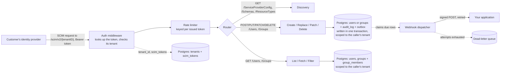

<div align="center">

# 🛡️ SCIMage

**SCIM Audit & Governance Engine**

### A SCIM 2.0 provisioning server with signed change delivery and an AI-advisory audit trail


</div>

SCIMage is a focused SCIM 2.0 server written in Go. It implements the core `/Users` and `/Groups` resources from [RFC 7644](https://datatracker.ietf.org/doc/html/rfc7644), backed by real Postgres, with security practices that are load-bearing and covered by tests.

## 💡 Why I built this

I spent years building JML (joiner mover leaver) automation on the identity provider side, configuring Okta Workflows to push user provisioning into 60+ SaaS applications. That gave me a solid understanding of the SCIM spec from the client's point of view.

This project is the other half: the server that receives those SCIM calls and applies them, which is the side most SaaS products build and maintain themselves. It demonstrates both ends of the handshake.

## ⚙️ What it does

SCIMage is the *service provider* side of SCIM: the endpoint an identity provider provisions into. One deployment serves many customer organizations at once: each is a **tenant**, addressed under its own `/scim/v2/{tenantID}` path with its own issued token, isolated from every other tenant's data.

| Method | Endpoint                          | Behaviour                                                                       |
|--------|-----------------------------------|----------------------------------------------------------------------------------|
| POST   | `/scim/v2/{tenantID}/Users`       | Creates a user. `201` with a `Location` header, `409` on a duplicate `userName` |
| GET    | `/scim/v2/{tenantID}/Users/{id}`  | Fetches one user                                                                |
| GET    | `/scim/v2/{tenantID}/Users`       | Lists users, paginated with `startIndex` and `count`                            |
| PUT    | `/scim/v2/{tenantID}/Users/{id}`  | Replaces a user's attributes                                                    |
| PATCH  | `/scim/v2/{tenantID}/Users/{id}`  | Applies operations to a user (how identity providers deprovision)               |
| DELETE | `/scim/v2/{tenantID}/Users/{id}`  | Deactivates a user, preserving the row and its history                          |
| POST   | `/scim/v2/{tenantID}/Groups`      | Creates a group. `201` with a `Location` header, `409` on a duplicate `displayName` |
| GET    | `/scim/v2/{tenantID}/Groups/{id}` | Fetches one group, with its members                                            |
| GET    | `/scim/v2/{tenantID}/Groups`      | Lists groups, paginated with `startIndex` and `count`                           |
| PUT    | `/scim/v2/{tenantID}/Groups/{id}` | Replaces a group's attributes and its whole membership set                     |
| PATCH  | `/scim/v2/{tenantID}/Groups/{id}` | Adds, removes or replaces members (how identity providers push group membership) |
| DELETE | `/scim/v2/{tenantID}/Groups/{id}` | Deletes a group. Unlike Users there is no `active` attribute to deactivate into, so this is a real deletion |

The discovery endpoints `/ServiceProviderConfig`, `/ResourceTypes` and `/Schemas` (same `/scim/v2/{tenantID}` prefix) declare exactly the attributes this server stores. A client reads them before provisioning.

`GET .../Users` supports `filter=userName eq "…"` and `filter=externalId eq "…"`; `GET .../Groups` supports `filter=displayName eq "…"` and `filter=externalId eq "…"` — the lookups a provider uses to decide whether a resource already exists. Other expressions answer `400` with `scimType: invalidFilter`, telling the client plainly where the supported set ends.

Responses use `application/scim+json`, and errors use the SCIM Error schema with the appropriate `scimType`.

`userName` uniqueness is enforced case-insensitively, matching the spec's `caseExact=false` characteristic, so `bjensen` and `BJensen` are one identity.

**Validated against [Microsoft's Entra ID SCIM validator](https://scimvalidator.microsoft.com/).** Core CRUD, filtering, and PATCH all pass. The `User` schema is deliberately reduced to a minimal set of typed columns — `displayName`, `title`, `preferredLanguage`, `name.formatted`/`name.middleName`, the enterprise extension and typed multi-valued emails aren't modeled that way. When a provider needs them, an operator registers the extra attributes per tenant (`scimage-admin attribute register`, gated by `SCIM_EXTENDED_ATTRIBUTES`) and the server captures and returns them through a JSONB pass-through — keeping the core minimal while still round-tripping whatever Okta or Entra maps. See [Configuration](docs/CONFIGURATION.md#extensible-attributes).

## 🏗️ How it's built



A mutation writes the user or group row, its audit entry and its outbound event in one transaction, so a change always carries its record and its notification. `audit_log` carries a `resource_type` column so one trail covers both resources. Every query in that path is scoped by `tenant_id`, so one customer's token can never read or change another's data. The handler depends on `UserStore` and `GroupStore` interfaces, so an application with its own tables can supply an implementation and skip webhooks entirely.

[Architecture](docs/ARCHITECTURE.md) covers the request path, the storage model and that interface's contract.

## 📤 Change delivery

Provisioning pays off once the change reaches the system that needs it. Every mutation queues a signed webhook, so a user created by an identity provider lands in your application directly.

The event is queued in the mutation's own transaction, so a committed change is always queued. Delivery is at-least-once with retries and a dead-letter queue, and requests are signed with HMAC-SHA256 over the timestamp, delivery id, event type and body. Events name what happened to the user: a person moving from active to inactive emits `user.deactivated` whether the provider sent `DELETE` or `PATCH active:false`.

Set `SCIM_WEBHOOK_URL` to turn it on. [Architecture](docs/ARCHITECTURE.md#change-delivery) covers the outbox, claim leases, retry rules, the signing scheme and the event payload; `webhook.Verify` is exported for Go receivers.

## 🔒 Security practices

These are load-bearing, and each one is covered by tests:

- **Issued, tenant-scoped tokens, never a shared secret.** Each token is `scimage_<keyID>_<secret>`; only `sha256(secret)` is stored, and a lookup by key id is compared with `crypto/subtle.ConstantTimeCompare` against the stored hash. A token also has to name the right tenant in the URL. A valid token for one customer is a 401 against another's path.
- **Auth applied by the router itself.** `Routes()` wraps every path in the token check, so authentication covers the whole surface structurally, and rejects unregistered paths the same way as real ones.
- **Cross-tenant isolation is structural, not a filter.** Every store query is scoped by `tenant_id`, including lookups by id, so a token from one tenant naming another tenant's real user id gets the same 404 as a made-up one.
- **Audit logging in the same transaction as the change.** Create, replace and deactivate each write an entry (actor, action, target user ID, timestamp, before/after state) inside the transaction that makes the change, so the entry and the change commit together. Refusals are recorded too, which makes a burst of denied deactivations visible to a reviewer.
- **Privileged CLI actions are audited too.** Creating a tenant, issuing a token and revoking one each write an `admin_audit_log` entry in the same transaction as the change, naming a real operator by default (`$USER`, overridable with `-created-by`) rather than a generic string. `scimage-admin audit list` reads it back.
- **Tenant names are unique, case-insensitively.** Two customers can't silently share a display name; `tenant create` rejects an exact or case-variant duplicate the same way `userName` uniqueness does.
- **Schema validation before the database.** Every incoming SCIM payload is checked against the expected shape, with attribute lengths bounded, before it reaches a query.
- **Signed outbound webhooks.** Change events are signed with HMAC-SHA256 and verified with `hmac.Equal`. A configured endpoint requires a secret at startup, so every event that goes out is signed. Plaintext endpoints are opt-in for local receivers.
- **Rate limiting per caller.** A token bucket returns `429` with `Retry-After`, so a runaway sync loop stays bounded.
- **Secrets from the environment.** The webhook secret and database credentials are read from environment variables at runtime; bearer tokens are issued and stored in Postgres rather than configured, so a leak is revoked, not rotated by redeploying. Git hooks scan staged diffs for credential-shaped content, and CI runs `govulncheck` against dependencies.

Every setting comes from an environment variable; see [Configuration](docs/CONFIGURATION.md) for the full list.

Operational logs are structured JSON on stdout and in a dated file under `LOG_DIR`. The audit trail is separate and lives in the `audit_log` table, so a change and its record commit together.

## 🚀 Getting started

```bash
git clone https://github.com/meghamahna/SCIMage.git
cd SCIMage

# copy the env template and fill in real values (.env is gitignored)
cp .env.example .env

# start Postgres and apply schema migrations
make up

# run the server
make run
```

The server starts on `:8080`. Migrations run through `golang-migrate`, and `make migrate` uses a host `migrate` binary when one is present and the official container otherwise. See [Local development](docs/LOCAL-DEVELOPMENT.md) for prerequisites and the full set of targets.

## 🏢 Creating a tenant

There's no `SCIM_TOKEN` to configure. A deployment starts with zero tenants and zero tokens, both issued through `cmd/scimage-admin`, which talks to Postgres directly rather than over the network:

```bash
make tenant NAME="Acme Corp"
# TENANT ID      tenant_9f2a1b3c...
# NAME           Acme Corp
# CREATED BY     megha
# SCIM BASE URL  <SCIM_BASE_URL>/scim/v2/tenant_9f2a1b3c...

make token TENANT=tenant_9f2a1b3c... LABEL="Okta prod"
# TOKEN ID    ...
# TENANT      tenant_9f2a1b3c...
# LABEL       Okta prod
# CREATED BY  megha
#
# Shown once, not stored anywhere. Save it now:
# scimage_...
```

`CREATED BY` defaults to `$USER`; pass `-created-by` (or run the underlying `go run ./cmd/scimage-admin ...` form directly) to attribute it to something else, e.g. automation. Every tenant created and every token issued or revoked is recorded in `admin_audit_log`; `go run ./cmd/scimage-admin audit list` reads it back.

That base URL and token are what get pasted into the customer's Okta or Entra app as its SCIM Base URL and Bearer token. `token list` / `token revoke` manage rotation from there; see [Configuration](docs/CONFIGURATION.md#tenants-and-tokens).

## 📬 Example request

```bash
# $TENANT_ID and $TOKEN are the values scimage-admin printed above.
curl -X POST "http://localhost:8080/scim/v2/$TENANT_ID/Users" \
  -H "Authorization: Bearer $TOKEN" \
  -H "Content-Type: application/scim+json" \
  -d '{
    "schemas": ["urn:ietf:params:scim:schemas:core:2.0:User"],
    "userName": "jdoe",
    "name": {"givenName": "Jane", "familyName": "Doe"},
    "emails": [{"value": "jdoe@example.com", "primary": true}]
  }'
```

## ✅ Running tests

```bash
make up      # the integration tests use a real Postgres
make test
```

Store and audit tests run against a real Postgres instance via `docker-compose`, exercising the actual SQL and constraints. Handlers are driven through `httptest`, and the webhook dispatcher against a real `httptest` receiver. Every suite cleans up the rows it creates.

## 🗺️ Roadmap

Phases 1–11 are complete: schema, endpoints, auth, audit, hardening, identity-provider interoperability, change delivery, multi-tenancy with issued API tokens, and the `/Groups` resource with membership. Phase 14 (per-tenant extensible attributes) has also shipped. ARIA, the advisory audit reviewer, is next, with release-engineering work ongoing.

The [implementation plan](docs/IMPLEMENTATION_PLAN.md) has the phase-by-phase detail, with the decisions and trade-offs recorded as they were made.

## 📚 Documentation

- [Architecture](docs/ARCHITECTURE.md): request path, storage model, change delivery internals
- [Configuration](docs/CONFIGURATION.md): every environment variable, and token rotation
- [Local development](docs/LOCAL-DEVELOPMENT.md): prerequisites and every `make` target
- [Implementation plan](docs/IMPLEMENTATION_PLAN.md): the phase-by-phase build, with decisions recorded

## 🧰 Tech

Go with the standard library `net/http`, Postgres 16 via `pgx` with raw SQL, and `golang-migrate` for schema migrations. Few layers between the code and what runs.

## 📄 License

MIT, see [LICENSE](LICENSE).
