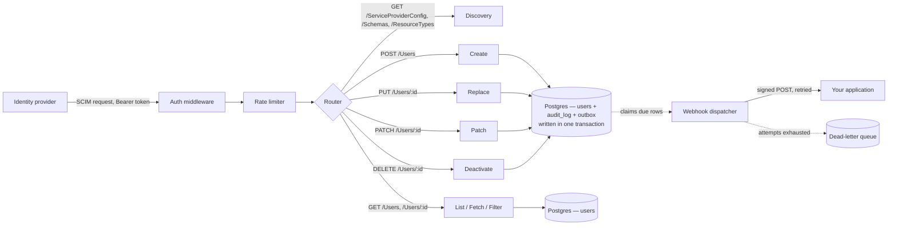

<div align="center">

# 🛡️ SCIMage

### A SCIM 2.0 provisioning server, built from the other side of the wire


</div>

SCIMage is a focused SCIM 2.0 server written in Go. It implements the core `/Users` resource from [RFC 7644](https://datatracker.ietf.org/doc/html/rfc7644), backed by real Postgres, with security practices that are load-bearing and covered by tests.

## 💡 Why I built this

I spent two years building JML (joiner mover leaver) automation on the identity provider side, configuring Okta Workflows to push user provisioning into 60+ SaaS applications. That gave me a solid understanding of the SCIM spec from the client's point of view.

This project is the other half: the server that receives those SCIM calls and applies them, which is the side most SaaS products build and maintain themselves. It demonstrates both ends of the handshake.

## ⚙️ What it does

SCIMage is the *service provider* side of SCIM — the endpoint an identity provider provisions into. It implements the core `/Users` resource:

| Method | Endpoint      | Behaviour                                                                       |
|--------|---------------|---------------------------------------------------------------------------------|
| POST   | `/Users`      | Creates a user. `201` with a `Location` header, `409` on a duplicate `userName` |
| GET    | `/Users/{id}` | Fetches one user                                                                |
| GET    | `/Users`      | Lists users, paginated with `startIndex` and `count`                            |
| PUT    | `/Users/{id}` | Replaces a user's attributes                                                    |
| PATCH  | `/Users/{id}` | Applies operations to a user — how identity providers deprovision               |
| DELETE | `/Users/{id}` | Deactivates a user, preserving the row and its history                          |

Plus the discovery endpoints a client reads before provisioning — `/ServiceProviderConfig`, `/ResourceTypes` and `/Schemas` — which declare exactly the attributes this server stores.

`GET /Users` supports `filter=userName eq "…"` and `filter=externalId eq "…"`, the lookups a provider uses to decide whether a user already exists. Other expressions answer `400` with `scimType: invalidFilter`, so a client is told plainly rather than handed an unfiltered list that would read as a match.

Responses use `application/scim+json`, and errors use the SCIM Error schema with the appropriate `scimType`.

`userName` uniqueness is enforced case-insensitively, matching the spec's `caseExact=false` characteristic — so `bjensen` and `BJensen` are correctly treated as the same identity.

## 🏗️ How it's built



The request path is deliberately plain: auth middleware checks the bearer token, the rate limiter admits the request, the router dispatches to a handler, the handler validates the payload and maps it to a Postgres row. Postgres is the single source of truth. Standard library `net/http` and raw SQL keep the behaviour visible in the code.

The handler talks to a `UserStore` interface rather than to Postgres directly. The bundled store is the default implementation; an application that already has its own user table can supply another and keep the SCIM surface. Two obligations come with that: the audit entry is written in the change's own transaction, and a `nil` error comes with a non-nil result.

## 📤 Change delivery

Provisioning is only useful if the change reaches the system that needs it. Every mutation queues a signed webhook, so a user created by an identity provider lands in your application without it polling.

**The queue shares the mutation's commit.** The outbound event is written to a `webhook_deliveries` row inside the same transaction as the change and its audit entry. A committed change is always queued and a rolled-back one never is — sending from the handler after `COMMIT` cannot give that, because the process can die between the two with no way to tell afterwards whether the event went out.

**Delivery is at-least-once, with a dead-letter path.** A dispatcher claims due rows by pushing a lease forward and counting the attempt in one statement (`FOR UPDATE SKIP LOCKED`), so two dispatchers claim disjoint sets and a crashed one's rows come back when the lease expires. The lease covers the whole batch rather than a single send, because a batch is delivered sequentially — a lease sized for one row would let the rows queued behind the current send come due again mid-batch, double-POSTing them and, since the attempt is counted at claim time, halving each delivery's retry budget.

Failures retry on a doubling backoff with jitter. A `4xx` other than `408`/`429` is parked immediately — the receiver understood the request and rejected it, so retrying sends identical bytes for the same answer. Parked rows keep their payload and last error, so a human can see exactly what failed; replaying one is a manual `UPDATE` until the admin CLI arrives in Phase 10.

Redirects are not followed: the payload carries user attributes and is signed for the configured endpoint, so a `302` would hand both to a host nobody configured.

**Requests are signed with HMAC-SHA256.** The signature covers the timestamp, the delivery id, the event type and the body. The timestamp is inside the signed material rather than merely alongside it, which is what lets a receiver reject stale timestamps knowing a captured request cannot be re-stamped without the secret. The delivery id and event type are covered because a receiver is told to act on both — deduplicating on an unauthenticated key would let a replay through under a fresh id, and routing on a header an attacker can rewrite is no better than not checking it:

```http
POST /scim-events HTTP/1.1
X-SCIMage-Event: user.deactivated
X-SCIMage-Delivery-Id: 4172
X-SCIMage-Signature: t=1772357400,v1=9f86d081884c7d659a2feaa0c55ad015a3bf4f1b2b0b822cd15d6c15b0f00a08
Content-Type: application/json

{"type":"user.deactivated","occurredAt":"2026-03-01T09:30:00Z","userId":"…","before":{…},"after":{…}}
```

Events name what happened to the user rather than which endpoint was called, so a receiver doesn't need to know whether its identity provider deprovisions with `DELETE` or `PATCH active:false` — a user going from active to inactive emits `user.deactivated` either way. Both images are included, so a receiver reconciling its own copy can see what changed rather than only what the row now says.

Because retries are independent, events for one user can arrive out of order — a retried `user.created` can land after a later `user.deactivated`. `occurredAt` carries the database clock and both images are present, so a receiver can order them itself; applying idempotently and preferring the newest `occurredAt` per user is the intended pattern.

`webhook.Verify` is exported for Go receivers; it compares with `hmac.Equal`, which is constant-time.

Change delivery is off unless `SCIM_WEBHOOK_URL` is set — with no dispatcher draining it, the queue would only grow.

## 🔒 Security practices

These are load-bearing, and each one is covered by tests:

- **Constant-time token comparison.** Bearer tokens are compared with `crypto/subtle.ConstantTimeCompare` over SHA-256 digests. Hashing gives both sides a fixed width, keeping the comparison constant-time with respect to the token's length as well as its content.
- **Auth applied by the router itself.** `Routes()` wraps every path in the bearer check, so authentication covers the whole surface structurally rather than per handler.
- **Audit logging in the same transaction as the change.** Create, replace and deactivate each write an entry — actor, action, target user ID, timestamp, before/after state — inside the transaction that makes the change. The entry and the change commit together, so every modification carries a record. Refusals are recorded too, which makes a burst of denied deactivations visible to a reviewer.
- **Schema validation before the database.** Every incoming SCIM payload is checked against the expected shape, with attribute lengths bounded, before it reaches a query.
- **Signed outbound webhooks.** Change events are signed with HMAC-SHA256 over the timestamp and body, verified with `hmac.Equal`. A configured URL without a secret is a startup error rather than an unsigned send — a receiver with no way to tell a real event from a forged one is worse than no webhook. Plaintext endpoints are opt-in, and redirects are never followed.
- **Rate limiting per caller.** A token bucket returns `429` with `Retry-After`, so a runaway sync loop is bounded.
- **Secrets from the environment.** The bearer token and database credentials are read from environment variables at runtime. Git hooks scan staged diffs for credential-shaped content, and CI runs `govulncheck` against dependencies.

### Configuration

| Variable                              | Purpose                                                                                 |
|---------------------------------------|-----------------------------------------------------------------------------------------|
| `SCIM_TOKEN`                          | Bearer token every request presents. Required — the server validates it at startup.     |
| `DATABASE_URL`                        | Postgres connection string. Assembled from `POSTGRES_*` when unset.                     |
| `SCIM_ADDR`                           | Listen address. Defaults to `:8080`.                                                    |
| `SCIM_BASE_URL`                       | External base URL, used for `Location` and `meta.location` when running behind a proxy. |
| `SCIM_RATE_LIMIT` / `SCIM_RATE_BURST` | Token bucket, in requests per second. Defaults to 20/40.                                |
| `SCIM_WEBHOOK_URL`                    | Endpoint for change events. Unset disables change delivery entirely.                    |
| `SCIM_WEBHOOK_SECRET`                 | HMAC signing secret. Required whenever a webhook URL is set; minimum 16 characters.     |
| `SCIM_WEBHOOK_ALLOW_HTTP`             | Set to `1` to allow a plaintext endpoint. For a local receiver only — events carry PII. |
| `SCIM_WEBHOOK_MAX_ATTEMPTS`           | Attempts before a delivery is dead-lettered. Defaults to 6.                             |
| `LOG_DIR`                             | Directory for dated log files. Defaults to `logs/`; set it empty for stdout only.       |
| `LOG_LEVEL`                           | `debug`, `info`, `warn` or `error`. Defaults to `info`.                                 |
| `SCIM_LOG_REQUESTS`                   | Set to `1` to record request bodies, which include user attributes. Off by default.     |

Generate a token with `openssl rand -hex 32`. The server requires at least 16 characters.

### Logs

Operational logs are structured JSON with RFC 3339 timestamps, written to
stdout and to a dated file under `logs/`:

```json
{"time":"2026-08-11T04:17:05.34Z","level":"INFO","msg":"request","method":"PATCH","path":"/Users/5f6e3041","status":200}
```

One file per day keeps a long-running process from producing a single unbounded
file. In a container, set `LOG_DIR=` (empty) and let the runtime collect stdout.

`SCIM_LOG_REQUESTS=1` adds the full request body to each entry, which is how a
client's actual behaviour gets diagnosed. Those entries contain user attributes,
so the log directory is created `0700`, files `0600`, and `logs/` and `*.log`
are gitignored.

These are operational logs. The audit trail is separate and lives in the
`audit_log` table, because a change and its record have to commit together.

### Rotating the token

1. Generate a new token: `openssl rand -hex 32`
2. Set it as `SCIM_TOKEN` and restart the server.
3. Update the token in your identity provider.

Treat `SCIM_TOKEN` as a privileged credential — it authorizes directory changes — and rotate it whenever exposure is suspected. Dual-token rotation, which removes the restart from this sequence, is on the roadmap.

## 🚀 Getting started

```bash
git clone https://github.com/meghamahna/SCIMage.git
cd SCIMage

# copy the env template and fill in real values (.env is gitignored)
cp .env.example .env

# start Postgres and apply schema migrations
make up

# run the server
make run
```

The server starts on `:8080`. Migrations run through `golang-migrate`, and `make migrate` uses a host `migrate` binary when one is present and the official container otherwise. See [LOCAL-DEVELOPMENT.md](LOCAL-DEVELOPMENT.md) for prerequisites and the full set of targets.

## 📬 Example request

```bash
set -a; source .env; set +a

curl -X POST http://localhost:8080/Users \
  -H "Authorization: Bearer $SCIM_TOKEN" \
  -H "Content-Type: application/scim+json" \
  -d '{
    "schemas": ["urn:ietf:params:scim:schemas:core:2.0:User"],
    "userName": "jdoe",
    "name": {"givenName": "Jane", "familyName": "Doe"},
    "emails": [{"value": "jdoe@example.com", "primary": true}]
  }'
```

## ✅ Running tests

```bash
make up      # the integration tests use a real Postgres
make test
```

Store and handler tests run against a real Postgres instance via `docker-compose`, exercising the actual SQL and constraints. Handlers are driven through `httptest`. Both suites clean up the rows they create.

## 🗺️ Roadmap

Tracked in detail in [IMPLEMENTATION_PLAN.md](IMPLEMENTATION_PLAN.md).

- **Multi-tenancy with issued API tokens** *(next)* — per-tenant SCIM URLs, tokens stored as hashes and shown once at creation, revocation, and overlap-window rotation that needs no restart.
- **`/Groups`** — group resources and membership.
- **SAGE: SCIM Audit & Governance Engine** — a companion CLI (`cmd/sage`) that reads the audit trail and writes a plain-English summary of what merits a human's attention: bulk deactivations in a short window, off-hours changes, or a caller's volume rising sharply. SAGE is advisory by design: it surfaces signal, while every create, replace and deactivate stays in deterministic Go code. A sage advises; the code decides.
- **Release engineering** — health and readiness endpoints, graceful shutdown, a published container image, tagged releases, and setup guides for Okta and Entra.

## 🧰 Tech

Go with the standard library `net/http`, Postgres 16 via `pgx` with raw SQL, and `golang-migrate` for schema migrations. Few layers between the code and what runs.

## 📄 License

MIT, see [LICENSE](LICENSE).
