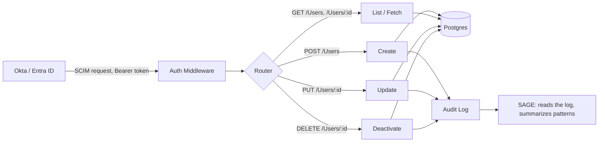

<div align="center">

# 🛡️ SCIMage

### A SCIM 2.0 provisioning server, built from the other side of the wire


</div>

SCIMage is a focused SCIM 2.0 server written in Go. It implements the core `/Users` resource from [RFC 7644](https://datatracker.ietf.org/doc/html/rfc7644), backed by real Postgres, with security practices that actually hold up rather than just look good in a README.

## 💡 Why I built this

I spent two years building JML (joiner mover leaver) automation on the identity provider side, configuring Okta Workflows to push user provisioning into 60+ SaaS applications. That gave me a solid understanding of the SCIM spec from the client's point of view.

This project is the other half. It's the server that actually receives those SCIM calls and applies them, which is the side most SaaS products have to build and maintain themselves. I wanted to prove I understand both ends of the handshake, not just the one I've worked with for two years.

## ⚙️ What it does

Point an identity provider (Okta, Entra ID, or anything else that speaks SCIM) at this server and it manages your user lifecycle automatically:

| Method | Endpoint      | Purpose                     |
|--------|---------------|------------------------------|
| POST   | `/Users`      | Create a new user           |
| GET    | `/Users/{id}` | Fetch a single user         |
| GET    | `/Users`      | List users, paginated       |
| PUT    | `/Users/{id}` | Replace a user's attributes |
| DELETE | `/Users/{id}` | Deactivate a user           |

Every request is authenticated with a bearer token, the same way IdPs authenticate against real SCIM endpoints in production.

## 🏗️ How it's built



The request path is deliberately boring: auth middleware checks the bearer token, the router dispatches to a handler, the handler validates the payload and maps it to a Postgres row, and Postgres is the only source of truth. No ORM, no framework, nothing hiding what the code actually does.

## 🔒 Security practices

These aren't nice-to-haves bolted on at the end. They're load-bearing:

- **Constant-time token comparison.** Bearer tokens are checked with `crypto/subtle.ConstantTimeCompare`, never `==`, so timing differences can't leak information about the token.
- **Audit logging on every mutation.** Create, update, and deactivate all write a structured log entry: actor, action, target user ID, timestamp, and before/after state. Nothing changes silently.
- **Schema validation before the database.** Every incoming SCIM payload is checked against the expected shape before it ever reaches a query.
- **Secrets live in the environment, full stop.** The bearer token and database credentials are read from environment variables at runtime. Nothing is hardcoded, and nothing secret gets committed.

## 🧭 SAGE: SCIM Audit & Governance Engine

A small companion CLI, `cmd/sage`, reads the structured audit log and writes a plain-English summary of what's worth a human's attention: bulk deactivations in a short window, changes happening off-hours, or a single token suddenly making far more calls than usual.

SAGE is advisory only. It reads history and suggests what to look at, and that's the whole job. Every actual create, update, and deactivate stays in deterministic Go code that SAGE never touches. The name is the point: a sage advises, it doesn't decide.

## 🚀 Getting started

```bash
git clone https://github.com/meghamahna/SCIMage.git
cd SCIMage

# start Postgres
docker compose up -d

# apply schema migrations
make migrate

# set your auth token
export SCIM_TOKEN=your-token-here

# run the server
go run ./cmd/server
```

The server starts on `:8080` by default.

## 📬 Example request

```bash
curl -X POST http://localhost:8080/Users \
  -H "Authorization: Bearer your-token-here" \
  -H "Content-Type: application/json" \
  -d '{
    "userName": "jdoe",
    "name": {"givenName": "Jane", "familyName": "Doe"},
    "emails": [{"value": "jdoe@example.com", "primary": true}],
    "active": true
  }'
```

## ✅ Running tests

```bash
go test ./...
```

Store-level tests run against a real Postgres instance via `docker-compose`, not a mock. If it works in the test suite, it works against the actual database.

## 🗺️ What's next

This is a focused v1, not a full SCIM stack. Deliberately left for later:

- `/Groups` endpoint
- SCIM filtering and complex PATCH operations
- Multi-tenant support

These are real trade-offs made to ship something solid end to end, not gaps in understanding of the spec.

## 🧰 Tech

Go with the standard library `net/http`, Postgres 16 via `pgx` with raw SQL, and `golang-migrate` for schema migrations. No framework, no ORM. Fewer layers between you and what's actually happening.

## 📄 License

MIT, see [LICENSE](LICENSE).
