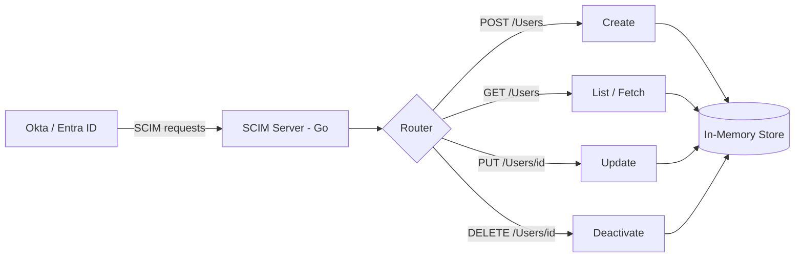

# SCIM 2.0 Provisioning Server

A minimal SCIM 2.0 server written in Go, implementing the core `/Users`
resource per [RFC 7644](https://datatracker.ietf.org/doc/html/rfc7644).

## Why I built this

I spent two years building JML (joiner-mover-leaver) automation on the
identity provider side — configuring Okta Workflows to push user
provisioning into 60+ SaaS applications. That work gave me a solid
understanding of the SCIM spec from the client side. This project is
the other half: building the server that actually receives those SCIM
calls and applies them, which is the side most SaaS products have to
build and maintain.

## What it does

An identity provider (Okta, Entra ID, etc.) can point at this server
and manage user lifecycle automatically:

| Method | Endpoint         | Purpose                          |
|--------|------------------|-----------------------------------|
| POST   | `/Users`         | Create a new user                 |
| GET    | `/Users/{id}`    | Fetch a single user                |
| GET    | `/Users`         | List users (paginated)             |
| PUT    | `/Users/{id}`    | Replace a user's attributes         |
| DELETE | `/Users/{id}`    | Deactivate a user                   |

Requests are authenticated with a bearer token, matching how IdPs
authenticate against real SCIM endpoints.

## Getting started

```bash
git clone https://github.com/<your-username>/scim-server.git
cd scim-server
go run ./cmd/server
```

Server starts on `:8080` by default. Set the auth token with:

```bash
export SCIM_TOKEN=your-token-here
```

## Example request

```bash
curl -X POST http://localhost:8080/Users \
  -H "Authorization: Bearer your-token-here" \
  -H "Content-Type: application/json" \
  -d '{
    "userName": "jdoe",
    "name": {"givenName": "Jane", "familyName": "Doe"},
    "emails": [{"value": "jdoe@example.com", "primary": true}],
    "active": true
  }'
```

## Architecture



## Running tests

```bash
go test ./...
```

## SAGE — SCIM Audit & Governance Engine

A small companion CLI (`cmd/sage`) reads the structured audit log and
produces a plain-English summary of patterns worth a human's
attention — bulk deactivations in a short window, off-hours changes,
a token spiking in call volume.

SAGE is advisory only. It never makes or influences an authorization
or provisioning decision — every actual create/update/deactivate stays
in deterministic Go code. The name is deliberate: a sage advises, it
doesn't decide.

## What's not in scope (v1)

This is a focused implementation, not a full SCIM stack. Deliberately
left out for now:

- `/Groups` endpoint
- SCIM filtering and complex PATCH operations
- Persistent storage (currently in-memory)
- Multi-tenant support

These are the natural next steps and reflect real trade-offs, not gaps
in understanding of the spec.

## Tech

Go, standard library `net/http` only — no framework, to keep the
implementation transparent and dependency-free.
